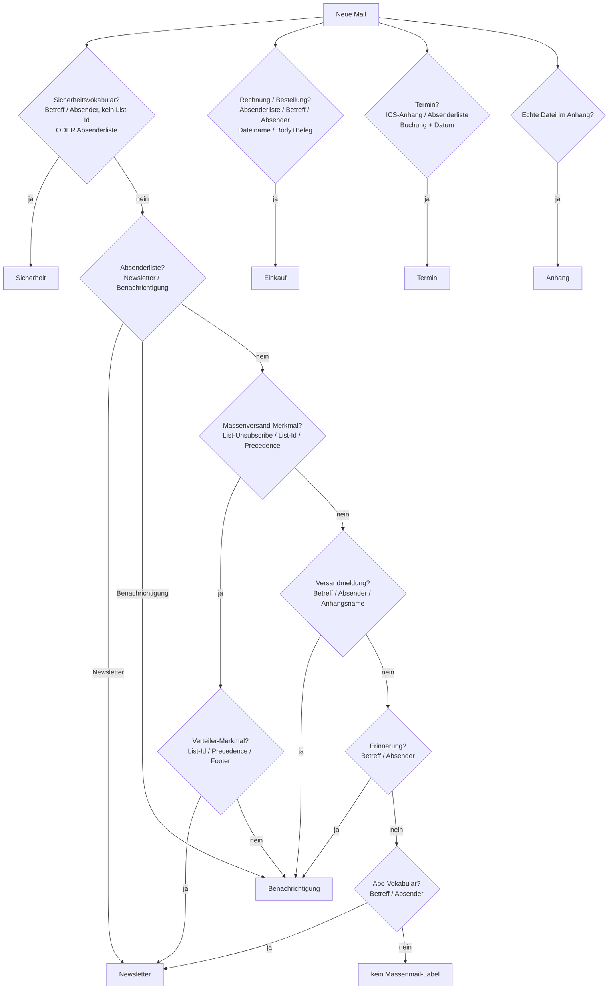

# Gmail Auto-Label – Bedienungsanleitung

Version 2.19 · Stand 01.09.2026

## Was das Skript macht

Das Skript vergibt automatisch Gmail-Labels nach festen Regeln. Jede Entscheidung beruht auf technischen Signalen der E-Mail (Header, Anhangstypen, Dateinamen) oder auf einfachen Textvergleichen mit hinterlegten Wortlisten. Es findet keine inhaltliche Bewertung durch ein KI-Modell statt, und es werden keine Mail-Inhalte an Dritte übertragen: Alles läuft auf Google-Servern im eigenen Konto.

Das Paket besteht aus **zwei Dateien**, die beide ins Apps-Script-Projekt gehören: `gmail-auto-label.gs` mit der Logik und `keywords.gs` mit sämtlichen Suchbegriffen und Absenderadressen, eine Zeile je Eintrag. Wer die Zuordnung nachjustiert, arbeitet ausschließlich in der zweiten Datei – siehe „Keywords und Absender pflegen".

| Label | Erkennungsmerkmal |
|---|---|
| **Sicherheit** | Kontowarnung, Anmeldeversuch, Passwort- oder Verifizierungsmail sowie alles mit „warnung"/„warning" in Betreff oder Absender. Hat Vorrang vor Newsletter und Benachrichtigung; Threads eines echten Verteilers (List-Id) sind ausgenommen. Hieß nur in 2.16 „Warnung". |
| **Newsletter** | Massenmail eines echten Verteilers, erkannt an List-Id oder Precedence; ersatzweise an Abo-Vokabular in Betreff oder Absender (newsletter, An-/Abmeldung, subscription …) oder an typischen Newsletter-Footern im Text. Abo-Vokabular greift auch ganz ohne Massenversand-Merkmal – so werden Willkommens- und Double-Opt-in-Mails erfasst; „Anmeldung" zählt dabei nur in Kombinationen („Anmeldebestätigung", „Ihre Anmeldung"), damit Login-Mails außen vor bleiben. Als Massenmail gilt, was List-Unsubscribe, List-Id oder Precedence führt. |
| **Benachrichtigung** | Transaktionsmail mit Abmeldelink, aber ohne Verteiler- oder Abo-Merkmal; zusätzlich Versand-, Zustell- und Rücksendemeldungen (Einlieferungsbeleg, Sendungsverfolgung, Retoure) sowie Erinnerungsmails und Telefon-Benachrichtigungen (verpasster Anruf, Voicemail), anhand von Betreff, Absender oder Anhangsnamen. |
| **Einkauf** | Rechnungs-, Bestell-, Rückgabe- oder Zustellbegriff (Rückgabe, Retoure, return, refund, Erstattung, Zustellung, Auslieferung) im Betreff, Absender (z. B. orders@, billing@, ruecksendung@) oder Anhangsnamen; im Fließtext nur zusammen mit PDF-Anhang oder Download-Hinweis. |
| **Termin** | Kalendereinladung mit ICS-Anhang; ersatzweise Buchungsbegriff oder Erinnerungsvokabular in Betreff oder Absender **und** konkretes Datum im Betreff (bei persönlicher Post genügt das Datum im Text). |
| **Anhang** | Mindestens eine echte Datei im Anhang. Inline-Bilder zählen nie, Bilddateien in Massenmails ebenfalls nicht. Ergänzt die anderen Labels, statt mit ihnen zu konkurrieren. |

Nicht erkannte Mails bleiben ungelabelt. Das ist beabsichtigt und entspricht faktisch der Kategorie „privat".

## So entscheidet das Skript



Die vier Regelblöcke laufen unabhängig voneinander – ein Thread kann mehrere Labels bekommen, etwa „Einkauf", „Termin" und „Anhang" bei einer Buchungsbestätigung mit Kalenderdatei und Beleg.

Innerhalb des ersten Blocks gilt eine feste Reihenfolge, der erste Treffer gewinnt: **Sicherheit → Absenderlisten → Massenmail (Newsletter oder Benachrichtigung) → Versandmeldung → Erinnerung → Abo-Vokabular.** Die Absenderlisten aus `keywords.gs` stehen bewusst weit vorn: Ein dort eingetragener Absender soll sein Label bekommen, ohne dass eine Header-Prüfung ihn noch umsortieren kann. Sicherheit steht vorn, weil eine Kontowarnung keine Werbung ist, auch wenn der Versender pauschal einen Abmeldelink mitschickt. Versandmeldung und Erinnerung stehen vor dem Abo-Vokabular – „Rücksendung angemeldet" ist eine Benachrichtigung, kein Newsletter. Alles passiert in einem Durchgang über dieselbe Thread-Liste, ein Thread bekommt aus diesem Block also genau ein Label. Eine Terminerinnerung ohne ICS-Anhang, aber mit Datum im Betreff, bekommt zusätzlich über den unabhängigen dritten Regelblock das Label Termin – zwei Labels aus zwei verschiedenen Blöcken, das ist gewollt.

## Einrichtung

Alle Schritte finden im Apps-Script-Editor unter **script.google.com** statt, nicht in Gmail. In Gmail selbst gibt es keine Menüpunkte für das Skript – dort erscheinen nur die vergebenen Labels in der linken Seitenleiste.

1. `script.google.com` öffnen, **Neues Projekt** anlegen, Projektnamen oben links in „Gmail Auto-Label" ändern.
2. Beispielcode löschen, Inhalt von `gmail-auto-label.gs` einfügen, speichern.
3. **Zweite Datei anlegen:** links neben „Dateien" auf das **Plus**, **Script** wählen, als Namen `keywords` eingeben (die Endung `.gs` hängt der Editor selbst an), den vorgegebenen Beispielinhalt vollständig löschen und den Inhalt von `keywords.gs` einfügen, speichern. Ihr gesamter Inhalt ist eine einzige Konstante `KEYWORDS_TEXT`, ein mehrzeiliger Text zwischen zwei Backticks – alles dazwischen wird wie eine Textdatei gelesen, ein Keyword pro Zeile, ohne Anführungszeichen und Komma. Fehlt die Datei oder die Konstante darin, brechen `labelAll` und `dryRun` mit einer Meldung im Protokoll ab.
4. **Projekteinstellungen (Zahnrad in der linken Leiste) → Zeitzone auf `Europe/Berlin`.** Neue Projekte stehen häufig auf `America/New_York`. Cursor und Datumsfilter werden in der Projektzeitzone formatiert, Gmail legt `before:`/`after:` aber in der Postfach-Zeitzone aus – bei abweichender Einstellung verschieben sich die Tagesgrenzen der Suche.
5. Labelnamen im Konfigurationsblock prüfen und bei Bedarf anpassen. Keine Leerzeichen verwenden: Die Namen landen unmaskiert in Gmail-Suchanfragen (`-label:Name`), wo ein Leerzeichen den Suchbegriff beendet.
6. Im Funktions-Dropdown über dem Code **`dryRun`** wählen und auf **Ausführen** klicken. Google fragt einmalig nach der Gmail-Berechtigung: Konto wählen, dann **Erweitert → Zu Projekt wechseln (unsicher)**. Das ist bei eigenen, nicht verifizierten Skripten normal und kein Fehler.
7. Ausgabe unten im **Ausführungsprotokoll** prüfen. Der Testlauf zeigt die neuesten 150 Threads je Regel – eine Stichprobe, kein Volltest. Passt die Zuordnung nicht, `keywords.gs` anpassen und `dryRun` wiederholen.
8. Erst wenn das Ergebnis stimmt: im selben Dropdown **`labelAll`** wählen und ausführen.

Vor dem ersten scharfen Lauf empfiehlt sich ein Test mit `BATCH_SIZE = 10`. Dann zeigt sich an wenigen Mails, ob die Regeln greifen, bevor das ganze Postfach verarbeitet wird.

## Erstbefüllung eines großen Postfachs

Ein Aufruf verarbeitet höchstens `BATCH_SIZE` Threads pro Regel, voreingestellt 150. Ein gewachsenes Postfach braucht deshalb viele Durchläufe. Statt manuell zu klicken, lässt man das Skript einmalig eng getaktet laufen:

1. Uhr-Symbol in der linken Leiste → **Trigger hinzufügen**
2. Funktion `labelAll`, Ereignisquelle **Zeitgesteuert**, Typ **Minutenintervall**, **alle 10 Minuten**
3. Laufen lassen, bis das Protokoll `=== Erstbefuellung abgeschlossen ===` meldet
4. Diesen Trigger löschen und durch den Dauerbetrieb ersetzen, etwa stündlich oder täglich

**Rechenbeispiel:** Rund 100 Threads je Regel dauern 20–30 Sekunden, ein kompletter `labelAll`-Lauf über alle vier Regelblöcke also gut zwei bis drei Minuten. Ein Postfach mit 5.000 Mails braucht etwa 35 Läufe. Bei einem privaten Konto begrenzt die Trigger-Laufzeit von 90 Minuten pro Tag auf rund 30 bis 45 Läufe – die Erstbefüllung ist damit in etwa einem Tag durch, bei sehr großen Postfächern über mehrere Tage verteilt.

`BATCH_SIZE` nicht deutlich über 150 setzen. Der Wert ist so gewählt, dass ein Lauf sicher unter der Sechs-Minuten-Grenze und unter dem Trigger-Intervall bleibt – dauert ein Lauf länger als der Abstand zum nächsten, weist die Sperre den Folgelauf ab. Ein Timeout wäre allerdings verkraftbar: Labels werden sofort beim Treffer gesetzt und bleiben erhalten, verloren geht nur das Fortschreiben des Cursors.

Wer Timeouts ganz vermeiden will, legt je Regel einen eigenen Trigger an (`labelBulkAndShipping`, `labelInvoices`, `labelEvents`, `labelAttachments`) statt `labelAll` zu verwenden. Dabei entfällt allerdings die automatische Zeitstempel-Verwaltung – das ist eine bewusste Entscheidung gegen den Dauerbetriebsmodus.

### Neue Mails während der Erstbefüllung

Solange eine Regel mit Rückwärts-Cursor arbeitet, sucht sie ausschließlich im Archivbereich vor ihrem Cursor. Neu eingehende Post wird in dieser Zeit **nicht** gelabelt. Das Skript merkt sich deshalb beim allerersten Lauf den Startzeitpunkt und verwendet ihn als ersten Zeitstempel des Dauerbetriebs – die ersten Vorwärtsläufe holen alles nach, was während der Befüllung ankam.

## Dauerbetrieb

Nach Abschluss der Erstbefüllung prüfen Folgeläufe nur noch Mails, die seit dem letzten Lauf eingegangen sind. Das spart Laufzeit und macht den Trigger-Betrieb dauerhaft schnell. Es entsteht kein zusätzliches Marker-Label in Gmail – der Zeitstempel liegt in den Script Properties.

Gehen mehr neue Mails ein, als ein Lauf schafft, legt die betroffene Regel wieder einen Cursor an und arbeitet den Rückstand ab. Der Zeitstempel rückt in diesem Fall nicht vor, damit nichts aus dem Suchzeitraum fällt. Ist der Rückstand abgearbeitet, wird als neuer Zeitstempel der **Beginn** der Aufholphase gesetzt – während des Aufholens eingetroffene Mails, die die Regel wegen ihres Cursors nicht sehen konnte, prüft der Folgelauf so noch einmal mit.

### Was im Protokoll steht

Zu Beginn jeder Regel nennt das Protokoll, ob sie bei den neuesten Mails ansetzt oder mit einem Rückwärts-Cursor im Archiv steht. Meldet eine Regel auffällig wenige Treffer, lohnt zuerst ein Blick auf diese Zeile: Sie zeigt, ob überhaupt der erwartete Bereich des Postfachs durchsucht wird.

## Keywords und Absender pflegen

Alles Vokabular steht in `keywords.gs`, nicht im Skript – konkret in der Konstante `KEYWORDS_TEXT`, einem mehrzeiligen Text zwischen zwei Backticks. Innerhalb der Backticks gilt: Eine Zeile `[sektionsname]` beginnt einen Abschnitt, jede weitere Zeile ist ein Eintrag, Zeilen ab `#` sind Kommentare. Zwei Zeichenfolgen dürfen darin nicht vorkommen – ein Backtick und `${` –, weil beide in einem JavaScript-Template-String eine Sonderbedeutung haben und das ganze Skript am Start scheitern lassen würden. In Keywords, Absenderadressen und Kommentaren kommt beides praktisch nie vor.

```
[einkauf]
rechnung
invoice
lieferschein

[einkauf.absender]
rechnung@telekom.de
@amazon.de
```

### Die Sektionen

| Sektion | Wirkung | Geprüft in |
|---|---|---|
| `[sicherheit]` | Label **Sicherheit** | Betreff, Absender |
| `[newsletter]` | Label **Newsletter** (Abo-Vokabular) | Betreff, Absender |
| `[newsletter.body]` | Label **Newsletter** (Footer-Formeln) | Nachrichtentext |
| `[benachrichtigung]` | Label **Benachrichtigung** (Versand, Zustellung) | Betreff, Absender, Anhangsname |
| `[erinnerung]` | Label **Benachrichtigung** (Erinnerungsmails) | Betreff, Absender |
| `[einkauf]` | Label **Einkauf** | Betreff, Absender, Anhangsname, Text |
| `[einkauf.download]` | Label **Einkauf**, nur zusammen mit einem `[einkauf]`-Treffer im Text | Nachrichtentext |
| `[termin]` | Label **Termin**, nur zusammen mit einem Datum | Betreff, Absender |
| `[sicherheit.absender]` `[newsletter.absender]` `[benachrichtigung.absender]` `[einkauf.absender]` `[termin.absender]` | dasselbe Label wie die zugehörige Keyword-Sektion | nur die Absenderadresse |

### Keywords

Verglichen wird in Kleinschreibung und **per Teilstring**: `bestell` trifft Bestellung, bestellt und Besteller. Deshalb möglichst Wortstämme eintragen – und vorher prüfen, in welchen häufigen Wörtern der Stamm sonst noch steckt (`order` steckt auch in „reorder" und „border"). Umlaute schreiben Absender uneinheitlich; wo das vorkommt, stehen beide Schreibweisen als eigene Zeilen untereinander.

### Absenderadressen

Die Absender-Sektionen sind das Werkzeug für die Fälle, in denen die Keyword-Regeln danebenliegen: ein Versender, der seine Werbung als Transaktionsmail verschickt, oder ein Shop, dessen Rechnungen im Betreff keinen erkennbaren Begriff tragen. Drei Schreibweisen sind erlaubt:

| Eintrag | Trifft |
|---|---|
| `rechnung@shop.de` | genau diese Adresse |
| `@shop.de` | die Domain `shop.de` samt Unterdomains wie `mail.shop.de` |
| `shop.de` | dasselbe, das führende `@` ist optional |

Anders als bei den Keywords wird hier **nicht** per Teilstring verglichen, sondern die Adresse exakt bzw. die Domain als Ganzes. `shop.de` trifft also weder `shop.de.beispiel.com` noch `fakeshop.de` noch einen Anzeigenamen, der „shop.de" enthält – das ist Absicht, sonst wären die Listen ein Einfallstor für gefälschte Absender.

**Ein Treffer in einer Absender-Sektion entscheidet sofort** und überspringt jede Gegenprüfung: Er gilt auch für Mails mit `List-Id`, auch ohne Datum im Betreff (Termin) und auch dann, wenn die Mail nach Massenversand aussieht. Wer eine Adresse einträgt, sagt damit „diese Post gehört immer hierhin". Bei `[termin.absender]` ist das besonders zu beachten – dort gehören nur Adressen hinein, die tatsächlich ausschließlich Termine verschicken, kein allgemeiner Shop-Absender.

Steht ein Absender in zwei Sektionen, entscheidet die Reihenfolge des ersten Regelblocks: Sicherheit vor Newsletter vor Benachrichtigung.

Die schnellste Quelle für passende Einträge ist `reportSenders()` – es listet je Label die häufigsten Absender. Wer dort einen falsch einsortierten Versender findet, trägt seine Adresse in die gewünschte Sektion ein.

### Nach einer Änderung: reicht das, oder braucht es einen neuen Lauf?

Das kommt darauf an, welche Mails man meint.

- **Speichern genügt.** Die Datei wird bei jedem Lauf frisch gelesen; ein neuer Eintrag greift ab dem nächsten Lauf, ganz ohne Zutun.
- **Für neu eingehende Mails ist damit alles getan.**
- **Für bereits geprüfte, ältere Mails nicht.** Im Dauerbetrieb durchsucht das Skript nur den Zeitraum seit dem letzten Lauf. Was davor liegt, hat es bereits bewertet und sieht es nicht wieder – der neue Eintrag ginge dort ins Leere. Dafür einmal **`resetRunTimestamp`** ausführen.

Ein solcher Reset startet zwar wieder eine vollständige Erstbefüllung, ist aber deutlich billiger als die erste: Alle bereits gelabelten Threads fallen über `-label:` aus der Suche, geprüft wird nur noch, was heute ungelabelt ist. Bei einem gepflegten Postfach sind das wenige Läufe.

Damit eine Änderung nicht vergessen wird, merkt sich das Skript einen Fingerabdruck der Datei und meldet im Protokoll, sobald sie sich geändert hat – mit dem Hinweis auf `resetRunTimestamp`. Wer den Reset lieber automatisch hätte, setzt im Skript `RESET_ON_KEYWORD_CHANGE` auf `true`; dann erledigt `labelAll` ihn beim ersten Lauf nach jeder Änderung selbst. Während der Erstbefüllung passiert in beiden Fällen nichts, dort arbeiten sich die Regeln ohnehin noch durch das gesamte Postfach.

Zwei Dinge bleiben in jedem Fall Handarbeit:

- Ein **bereits vergebenes Label verschwindet nicht**, wenn man das auslösende Keyword streicht. Dafür die passende `removeXxxLabel()`-Funktion ausführen und danach neu labeln lassen.
- Ein Thread, der schon ein Label des ersten Regelblocks trägt (Sicherheit, Newsletter, Benachrichtigung), wird von diesem Block nicht erneut angefasst – auch nicht nach einem Reset. Wer einen Absender von „Benachrichtigung" nach „Newsletter" umziehen lassen will, muss das alte Label erst entfernen.

Zur Kontrolle nach jeder Änderung: **`showKeywords()`** zeigt im Protokoll, was das Skript tatsächlich aus der Datei gelesen hat, und meldet vertippte Sektionsnamen sowie leere Pflichtsektionen.

## Wartung

- **Zuordnung prüfen:** `reportSenders()` zeigt je Label die häufigsten Absender – der schnellste Weg, Fehleinsortierungen der großen Versender zu finden.
- **Keyword-Listen erweitern:** Landen zu viele Newsletter unter „Benachrichtigung", deren typische Footer-Zeilen in `[newsletter.body]` ergänzen. Hilft das nicht, den Absender in `[newsletter.absender]` eintragen – das entscheidet unabhängig vom Text.
- **Nach jeder Listenänderung** `resetRunTimestamp` einmal manuell ausführen, damit auch ältere Mails erneut bewertet werden. Nicht in den Trigger eintragen. Details unter „Keywords und Absender pflegen".
- **Gelesene Datei kontrollieren:** `showKeywords()` zeigt je Sektion die Zahl der Einträge und meldet vertippte Sektionsnamen.
- **Labelnamen ändern:** Alte Labels bleiben in Gmail bestehen und müssen dort von Hand umbenannt oder gelöscht werden.
- **Neue Suchbegriffe:** Der Vergleich läuft auf Teilstrings. Vor dem Aufnehmen prüfen, in welchen häufigen Wörtern der Begriff sonst noch steckt – siehe „Bekannte Grenzen".

## Wenn etwas schiefgeht

Das Skript vergibt ausschließlich Labels. Es löscht, archiviert oder verschiebt nichts, und die Mails selbst bleiben unverändert. Im schlimmsten Fall sind Nachrichten falsch einsortiert – ein Datenverlust ist ausgeschlossen.

| Funktion | Wirkung |
|---|---|
| `showKeywords()` | Zeigt, was das Skript aus `keywords.gs` gelesen hat, je Sektion mit Anzahl und Einträgen. Meldet Sektionsnamen, die es nicht kennt (Tippfehler – ihre Einträge bleiben wirkungslos) und leere Pflichtsektionen. Erster Blick nach jeder Änderung an der Datei. |
| `debugHeaders()` | Zeigt für eine Stichprobe des Posteingangs, welche Massenversand-Header gesetzt sind. Erster Blick, wenn eine Regel auffällig wenige Treffer meldet. |
| `reportSenders()` | Häufigste Absender je Label. |
| `removeNewsletterLabel()` und die fünf Geschwister | Entfernen ein einzelnes Label von allen Threads. `removeLegacyWarningLabel()` und `removeLegacyWarningsLabel()` räumen die Labels „Warnung" (2.16) und „Warnungen" (2.14) ab, falls sie noch gefüllt sind. |
| `removeAllLabels()` | Entfernt alle sechs Labels und löscht den gespeicherten Fortschritt, setzt also komplett zurück. |
| `resetRunTimestamp()` | Löscht nur den Fortschritt (Zeitstempel, Cursor, Fertig- und Aufhol-Marken), behält die Labels. |

Die Entfernen-Funktionen arbeiten in Blöcken von `BATCH_SIZE` und müssen bei vielen betroffenen Mails mehrfach ausgeführt werden, bis der Zähler 0 meldet. Die Labels selbst bleiben in Gmail bestehen und lassen sich dort von Hand löschen.

## Kontingente und Berechtigungen

Apps Script begrenzt, wie lange und wie oft ein Skript laufen darf. Stand der offiziellen Google-Dokumentation: 22.07.2026.

| Grenze | Privates Gmail | Workspace |
|---|---|---|
| Laufzeit je Ausführung | 6 Minuten | 6 Minuten |
| Trigger-Laufzeit pro Tag | 90 Minuten | 6 Stunden |
| Gmail lesen/schreiben pro Tag | 20.000 | 50.000 |
| Properties lesen/schreiben pro Tag | 50.000 | 500.000 |
| Trigger je Skript | 20 | 20 |

Bindend ist bei einem privaten Konto die Trigger-Laufzeit pro Tag. Sie gilt **pro Nutzerkonto über alle Skripte hinweg**, nicht je Skript – das Aufteilen auf mehrere Apps-Script-Projekte bringt also kein zusätzliches Kontingent. Das Kontingent setzt sich 24 Stunden nach der ersten Anfrage zurück, nicht um Mitternacht.

Fehlgeschlagene Trigger-Läufe meldet Google per E-Mail – nach dem Scharfschalten also kurz auf Timeout-Meldungen achten.

**Berechtigungen:** Das Skript fordert Schreibzugriff auf Gmail an, weil es Labels setzen muss. Diese Berechtigung erlaubt technisch auch Löschen und Versenden – das Skript tut beides nicht, aber die Rechte werden pauschal erteilt. Wer das nachprüfen will, findet alle Gmail-Aufrufe im Quellcode.

Bei einem Workspace-Konto können Administratoren Apps Script einschränken oder ganz sperren.

## Bekannte Grenzen

- **Teilstring-Suche:** „rechnung" trifft auch „Rechnungsnummer" (gewollt), ebenso aber „Abrechnung".
- **`'bill'` als Suchbegriff** steckt auch in „Billard", „billig" und im Vornamen „Bill". Bei überwiegend deutschsprachigem Postfach aus der Liste entfernen.
- **`'auftrag'`** trifft auch „beauftragt" und „Auftraggeber", **`'order'`** auch „reorder" und „border", **`'termin'`** auch „Terminal" (Flughafen- und Zahlungsterminal-Mails).
- **Termine ohne ICS-Anhang** werden über Keywords erkannt und sind damit deutlich unschärfer als Kalendereinladungen. Terminbegriff und Datum müssen beide im Betreff stehen, sonst greift die Regel bei Massenmails nicht.
- **Terminabsagen** tragen ebenfalls einen ICS-Anhang und werden mitgelabelt.
- **Newsletter ohne List-Id** landen unter „Benachrichtigung", sofern kein bekannter Footer im Text steht. Die Auffangkategorie ist bewusst „Benachrichtigung", nicht „Newsletter".
- **Mehrfachlabel:** Ein Thread kann mehrere Labels bekommen. Bei „Anhang" ist das ausdrücklich so gewollt.
- **Versandmeldungen** werden nur über Betreff und Anhangsnamen erkannt. Paketdienste, die im Betreff nur eine Auftragsnummer nennen, rutschen durch – deren typische Formulierung lässt sich in `[benachrichtigung]` ergänzen, der Absender selbst in `[benachrichtigung.absender]`.
- **Retouren** nennen im Betreff oft auch die Bestellung und bekommen dann zusätzlich „Einkauf". Beide Labels sind hier gewollt.
- **Bilder in Massenmails** zählen nicht als Anhang. Eine Werbemail mit angehängtem Bildkatalog bleibt daher ohne „Anhang" – wer das anders will, leert `LAYOUT_IMAGE_TYPES`.
- **Absender-Prüfung (seit 2.10):** Alle Keyword-Regeln prüfen auch Adresse und Anzeigename des Absenders. Das ist gewollt (orders@, billing@, tracking@, buchung@, ruecksendung@ …), erhöht aber den Beifang: `'bill'` trifft Absendernamen wie Bill, `'order'` auch `border@…`, `'return'` auch `no-return@…`. Unerwünschte Begriffe aus der jeweiligen Sektion streichen und `resetRunTimestamp` ausführen. Nicht zu verwechseln mit den Absender-Sektionen (seit 2.19): Die vergleichen nur die Adresse und dafür exakt, ohne Teilstring-Beifang.
- **Sicherheit ist absichtlich breit:** Begriffe wie `login`, `passwort` oder `verifizieren` fangen auch harmlose Kontomails ein („Dein Code zum Login"), und `warnung` (seit 2.15) auch fachfremde Warnungen (Unwetterwarnung) sowie Dringlichkeits-Marketing („Letzte Warnung: Ihr Rabatt verfällt"). Das ist gewollt – bei dieser Kategorie kostet ein übersehener Treffer mehr als ein falscher. Ein Security-Newsletter mit List-Id bleibt Newsletter. Wer den Marketing-Beifang nicht mag, streicht `warnung` aus `[sicherheit]`.
- **Rückgabe-Mails tragen oft zwei Labels:** „Retoure" greift sowohl in `[benachrichtigung]` (Versandmeldung) als auch in `[einkauf]` (Einkauf). Das ist gewollt: Die Mail ist beides.
- **„Zustellung" ist auch ein Rechtsbegriff:** Amtliche und rechtliche Schreiben verwenden „Zustellung" im Sinne von „förmliche Bekanntgabe" („Zustellung eines Bescheids"). Da das Wort seit 2.13 in `[einkauf]` steht, gelten solche Mails ebenfalls als Einkauf. Wer das nicht will, streicht `zustellung` aus der Sektion und behält nur `auslieferung`.
- **Threads mit alter und neuer Post:** Die Suche mit `before:` matcht auf Nachrichtenebene, der Cursor rechnet mit dem Datum der letzten Nachricht. Ein alter, ungelabelter Thread mit frischer Antwort (typisch: eine laufende private Konversation) taucht deshalb während der Erstbefüllung in jedem Batch erneut auf und belegt einen Platz. Das kostet etwas Kontingent, blockiert den Fortschritt aber nicht.
- **Volle Tage:** Liegen mehr als `BATCH_SIZE` ungelabelte Threads auf einem einzigen Tag, wird der Rest dieses Tages übersprungen. Das Protokoll weist darauf hin. Abhilfe: `BATCH_SIZE` vorübergehend erhöhen und `resetRunTimestamp` ausführen.

## Datenschutz

Drei Regeln lesen den Mail-Text per `getPlainBody()`, und zwar erst als letzte Stufe, wenn die Header-Prüfung kein Ergebnis liefert: die Newsletter-Abgrenzung, die Rechnungserkennung und die Datumssuche der Terminregel. Die ICS-Stufe der Terminregel, die Versandmeldungsprüfung und die Header-Stufen der Massenmail-Regel kommen ohne Body-Zugriff aus.

Alle Zugriffe erfolgen ausschließlich innerhalb des eigenen Google-Kontos. Gesucht wird nur im normalen Posteingang – Archiv, Gesendet, Spam und Papierkorb bleiben außen vor. Wer auch das Archiv erfassen will, entfernt `in:inbox` aus den Suchanfragen.

Das gilt für dieses Skript. Wird die Auswertung zusätzlich über Claude Cowork automatisiert, verlassen Metadaten das Konto – siehe `claude-scheduled-tasks.md`.

**Zum Label Sicherheit:** Es macht genau die sensibelsten Mails des Postfachs als Gruppe auffindbar – Kontowarnungen, Anmeldecodes, Passwort-Mails. Innerhalb des eigenen Kontos ist das der Zweck. Bei einer Auswertung über Claude Cowork sollte dieses Label per `-label:<ID_SICHERHEIT>` aus den Abfragen ausgeschlossen werden, sonst landen seine Betreffzeilen im Bericht.

## Glossar

| Begriff | Bedeutung |
|---|---|
| **Apps Script** | Googles Programmierumgebung für Automatisierungen im eigenen Google-Konto. Läuft auf Google-Servern, wird über script.google.com bedient. |
| **Header** | Unsichtbarer technischer Vorspann jeder E-Mail. Das Skript liest daraus z. B., ob eine Mail einen Abmeldelink hat (List-Unsubscribe) oder von einem Verteiler stammt (List-Id). |
| **Label** | Gmails Etikett für Mails, sichtbar in der linken Seitenleiste. Eine Mail kann mehrere Labels tragen und bleibt dabei unverändert im Posteingang. |
| **Thread** | Eine Konversation in Gmail: die ursprüngliche Mail samt aller Antworten. Das Skript vergibt Labels immer für ganze Threads. |
| **Trigger** | Ein Zeitplan, der eine Skript-Funktion automatisch startet. Wird im Editor über das Uhr-Symbol eingerichtet. |
| **BATCH_SIZE** | Anzahl Threads, die eine Regel pro Lauf höchstens verarbeitet (voreingestellt 150). |
| **keywords.gs** | Zweite Datei des Projekts, eine normale Skriptdatei. Enthält alle Suchbegriffe und Absenderadressen als mehrzeiligen Text in der Konstante `KEYWORDS_TEXT`, je Zeile einen Eintrag, gegliedert in Sektionen. |
| **Sektion** | Abschnitt in `keywords.gs`, eingeleitet durch `[name]` auf einer eigenen Zeile. Jede Sektion gehört zu genau einer Regel. |
| **Absenderliste** | Sektion, die statt Suchbegriffen Absenderadressen enthält (`[…absender]`). Verglichen wird nur die Adresse, dafür exakt; ein Treffer entscheidet sofort. |
| **Script Properties** | Kleiner Speicher, der zum Skript gehört und Läufe überdauert. Hier liegen Zeitstempel, Cursor, Fertig- und Aufhol-Marken – unsichtbar für Gmail. |
| **Cursor** | Merkt sich je Regel, bis zu welchem Datum sie rückwärts gearbeitet hat. Existiert nur während der Erstbefüllung oder bei größerem Rückstand. |
| **Fertig-Marke** | Vermerkt, dass eine Regel das Postfachende erreicht hat. Sind alle Regeln markiert, schaltet das Skript in den Dauerbetrieb. |
| **Trockenlauf (dryRun)** | Testmodus: zeigt im Protokoll, welche Labels vergeben würden, ohne eines zu setzen und ohne gespeicherten Fortschritt zu verändern. |
| **Ausführungsprotokoll** | Ausgabebereich unten im Apps-Script-Editor. Dort erscheinen alle Meldungen des Skripts. |
| **Sicherheit (Label)** | Kontowarnungen, Anmeldeversuche, Passwort- und Verifizierungsmails. Wird als erstes geprüft und schließt die übrigen Labels des ersten Regelblocks aus. Hieß nur in 2.16 „Warnung". |
| **ICS-Anhang** | Kalenderdatei im Standardformat, die Einladungen aus Google Calendar, Outlook, Teams oder Zoom beiliegt. Für das Skript das eindeutige Signal für einen Termin. |
| **Kontingent (Quota)** | Googles Tageslimits für Skripte, etwa 90 Minuten Trigger-Laufzeit bei privaten Konten. Bei Überschreitung stoppt das Skript bis zum nächsten Tag – es geht nichts verloren. |

**Quelle Kontingente:** [Apps Script Quotas](https://developers.google.com/apps-script/guides/services/quotas), abgerufen am 30.08.2026.
