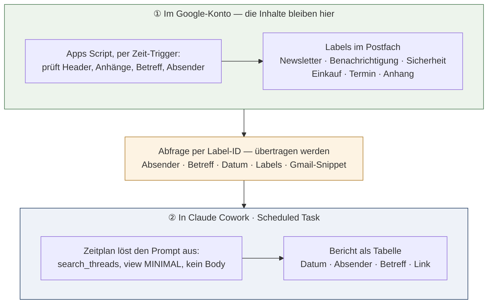

# Gmail-Automation mit Claude

Kurzanleitung: Scheduled Tasks + Gmail-Connector · zu Skript-Version 2.17 · Stand 31.08.2026

## Der Workflow auf einen Blick

Zwei getrennte Systeme teilen sich die Arbeit. Das Apps Script sortiert die Mails nach eigenem Zeitplan direkt im Google-Konto in Labels ein – ohne dass Inhalte das Konto verlassen. Der Scheduled Task in Claude fragt danach nur noch die fertigen Labels ab, mit minimalen Metadaten, und liefert einen anklickbaren Bericht.



> **Jeder Lauf ist eine Datenübertragung an Anthropic.**
> Die MINIMAL-Beschränkung ist eine Anweisung an das Modell, keine technische Sperre – ein Vollabruf ganzer Mails (`get_message`) bleibt jederzeit möglich. Übertragene Daten können je nach Bedingungen und Kontoeinstellungen ins KI-Training gelangen.

Die aufwendige, inhaltslesende Klassifikation passiert also nur im eigenen Google-Konto. Bei regelkonformen Läufen sieht Claude Absender, Betreff, Datum, Labels und das kurze Gmail-Snippet – nicht den vollständigen Mailtext. Garantiert ist das jedoch nicht, siehe Datenschutz-Hinweis unten.

## Das Prompt-Schema

Vier Bausteine, immer in dieser Reihenfolge:

**1 – Gebot (Guardrails)**
```
Nur search_threads mit view: THREAD_VIEW_MINIMAL.
Kein METADATA_ONLY / FULL_CONTENT / PLAIN_TEXT / RAW,
kein get_message - ausser fuer eine ausdruecklich genannte Einzelmail.
Paginiere mit pageToken, bis alle Treffer geladen sind
(search_threads liefert hoechstens 50 pro Aufruf, Standard 20).
```

**2 – Aufgabe (Was + Zeitraum + Filter)**
```
Zeig mir [ungelesene] Mails im Posteingang [der letzten 7 Tage],
[gruppiert nach Label / nur label:X / nur ungelabelte].
```

**3 – Ausgabe (Format)**
```
Tabelle: Datum (TT.MM.JJJJ) | Absender | Betreff | Link.
Link aus threadId: https://mail.google.com/mail/u/0/#all/THREAD_ID
- ohne zusaetzlichen Tool-Aufruf.
```

**4 – Transparenz (Nachweis)**
```
Nenne am Ende: verwendetes Tool, exakte Query, View-Stufe.
```

Baustein 1 und 4 bleiben in jedem Prompt identisch – sie sind die Leitplanken. Nur Baustein 2 und bei Bedarf Baustein 3 ändern sich je nach Anwendungsfall. Wichtig für Scheduled Tasks: Der Prompt muss vollständig sein, Claude kann während eines automatischen Laufs keine Rückfragen stellen.

## Einrichtung in Claude

**Voraussetzungen**

- Ein bezahlter Claude-Plan (Pro, Max, Team oder Enterprise) – Scheduled Tasks sind Teil von Claude Cowork.
- Claude muss mit dem Gmail-Konto verbunden sein: In den Claude-Einstellungen unter **Connectors** den Gmail-Connector hinzufügen und den Google-Anmeldedialog durchlaufen. Ohne diese aktive Verbindung schlägt jeder MCP-Aufruf des Scheduled Task fehl.
- Das Apps Script läuft und hat die Labels bereits vergeben – sonst gibt es nichts zu gruppieren.

**Task anlegen**

1. In Claude Cowork links in der Seitenleiste auf **Scheduled** klicken.
2. Oben rechts **New task** → **Set up manually** wählen (alternativ „Create with Claude" für einen geführten Dialog).
3. Im Formular eintragen: Name, Prompt (aus den Beispielen unten), Freigabemodus und Frequenz – stündlich, täglich, werktags, wöchentlich oder manuell.
4. **Save** klicken. Der Task erscheint auf der Scheduled-Tasks-Seite.

**Gut zu wissen**

- Scheduled Tasks laufen remote auf Anthropic-Servern – der eigene Rechner darf aus sein, die App geschlossen.
- Jeder Lauf ist eine eigene Cowork-Sitzung; die Ergebnisse stehen auf der Scheduled-Seite zum Nachlesen bereit.
- Tasks lassen sich dort jederzeit pausieren, bearbeiten, löschen oder manuell anstoßen („Run on demand").
- Der Task nutzt die Connectors des Claude-Kontos – jeder Lauf ist also ein echter Gmail-MCP-Zugriff mit den im Prompt gesetzten Grenzen.

## Label-IDs zuerst klären

Der Gmail-Connector erwartet bei `label:` die interne Label-ID, nicht den Anzeigenamen. Die IDs bleiben stabil, solange die Labels nicht gelöscht und neu angelegt werden.

**Einmalig ermitteln:** In einer normalen Cowork-Sitzung nach den Label-IDs für Newsletter, Benachrichtigung, Sicherheit, Einkauf, Termin und Anhang fragen (Claude ruft dafür `list_labels` auf). Die zurückgegebenen IDs – bei selbst angelegten Labels typischerweise `Label_1`, `Label_2` und so weiter – dann direkt in die Prompts unten eintragen, an die mit `<ID_…>` markierten Stellen.

Das spart in jedem Lauf einen Tool-Aufruf und verhindert leere Ergebnisse durch nicht aufgelöste Namen.

## Beispielprompts

Zum direkten Einfügen ins Prompt-Feld des Scheduled Task. Der Guardrail-Block ist überall gleich und der Kürze halber nur einmal ausgeschrieben – er gehört an den Anfang **jedes** Prompts:

```
Nutze fuer alle Gmail-Abfragen ausschliesslich search_threads mit view:
THREAD_VIEW_MINIMAL. Verwende niemals METADATA_ONLY, FULL_CONTENT,
PLAIN_TEXT oder RAW und rufe niemals get_message auf. Paginiere mit
pageToken, bis alle Treffer geladen sind - search_threads liefert
hoechstens 50 Threads pro Aufruf (Standard: 20).
```

Ebenso der Ausgabeblock:

```
Ausgabe als Tabelle: Datum (TT.MM.JJJJ) | Absender | Betreff | Link. Baue den
Link aus der threadId als https://mail.google.com/mail/u/0/#all/THREAD_ID,
ohne zusaetzlichen Tool-Aufruf. Nenne am Ende: Tool, exakte Query und
View-Stufe.
```

### 1 – Tägliche Ungelesen-Übersicht

Frequenz: täglich, z. B. morgens. Der Klassiker für den Tagesstart.

```
[Guardrail-Block]

Zeig mir alle ungelesenen Mails im Posteingang der letzten 24 Stunden
ausser den als Sicherheit gelabelten
(in:inbox is:unread -label:<ID_SICHERHEIT> newer_than:1d), gruppiert nach
Label; ungelabelte Mails als eigene Gruppe zuletzt.

[Ausgabeblock]
```

### 2 – Wöchentliche Rechnungsliste

Frequenz: wöchentlich, z. B. freitags. Sammelt alles unter „Einkauf" der letzten Woche – praktisch für Ablage und Buchhaltung.

```
[Guardrail-Block]

Liste alle Mails mit dem Label Einkauf aus den letzten 7 Tagen
(in:inbox label:<ID_EINKAUF> newer_than:7d), sortiert nach Datum absteigend.

[Ausgabeblock]
```

### 3 – Termin-Radar

Frequenz: werktags. Zeigt neue Termin-Mails, damit keine Buchung oder Einladung untergeht.

```
[Guardrail-Block]

Zeig mir alle Mails mit dem Label Termin der letzten 3 Tage
(in:inbox label:<ID_TERMIN> newer_than:3d). Wenn es keine Treffer gibt,
antworte nur mit einem Satz.

[Ausgabeblock]
```

### 4 – Wächter für Unsortiertes

Frequenz: wöchentlich. Findet Mails, die durch alle Skript-Regeln gefallen sind – das beste Signal, wann die Keyword-Listen nachjustiert werden sollten.

```
[Guardrail-Block]

Zeig mir alle Mails im Posteingang der letzten 7 Tage, die keines der Labels
Newsletter, Benachrichtigung, Sicherheit, Einkauf oder Termin tragen
(in:inbox -label:<ID_NEWSLETTER> -label:<ID_BENACHRICHTIGUNG>
-label:<ID_SICHERHEIT> -label:<ID_EINKAUF> -label:<ID_TERMIN> newer_than:7d)
- das Label Anhang zaehlt hier nicht als Einsortierung. Gruppiert nach Absender-Domain. Nenne
pro Domain die Anzahl. Wenn eine Domain 3-mal oder oefter vorkommt, markiere
sie als Kandidat fuer eine neue Regel im Apps Script.

[Ausgabeblock]
```

### 5 – Monats-Bilanz der Labels

Frequenz: manuell oder monatlich. Reine Zählung als Gesundheitscheck der Sortierung – hier genügt die Trefferzahl, kein Betreff nötig. Achtung: `has:nouserlabels` zählt anders als Beispiel 4 – eine Mail, die nur das Label Anhang trägt, gilt hier als gelabelt. Wer beide Auswertungen angleichen will, ersetzt `has:nouserlabels` durch die Negativ-Query aus Beispiel 4.

```
[Guardrail-Block]

Zaehle die Mails der letzten 30 Tage (in:inbox newer_than:30d) je Label
Newsletter, Benachrichtigung, Sicherheit, Einkauf, Termin, Anhang sowie ohne
Nutzer-Label (has:nouserlabels) - eine search_threads-Abfrage pro Gruppe.
Nutze fuer label: die IDs: <ID_NEWSLETTER>, <ID_BENACHRICHTIGUNG>,
<ID_SICHERHEIT>, <ID_EINKAUF>, <ID_TERMIN>, <ID_ANHANG>. Gib nur eine kompakte Tabelle Label | Anzahl aus,
keine Einzelmails.

Nenne am Ende: Tool, alle verwendeten Queries und die View-Stufe.
```

## Hinweise zu allen Beispielen

- **Label Sicherheit ausschliessen:** Unter diesem Label liegen Kontowarnungen, Anmeldecodes und Passwort-Mails – die sensibelsten Nachrichten des Postfachs. In den Beispielprompts ist es per `-label:<ID_SICHERHEIT>` ausgenommen, damit seine Betreffzeilen nicht in Berichten und damit nicht bei Anthropic landen. Wer es bewusst auswerten will, entfernt den Ausschluss.
- **Snippet-Grenze:** `THREAD_VIEW_MINIMAL` liefert technisch immer auch das kurze Gmail-Snippet mit – ein Inhaltsauszug von ein bis zwei Zeilen lässt sich mit diesem Connector nicht abwählen, ohne den Betreff zu verlieren.
- **Seitengröße:** `search_threads` liefert laut Tool-Schema standardmäßig 20 und höchstens 50 Threads pro Aufruf (`pageSize`); weitere Ergebnisse kommen nur über `pageToken`-Pagination. Ohne die Paginier-Anweisung im Guardrail-Block würde eine volle Inbox (Beispiel 1) stillschweigend bei 20 Treffern abgeschnitten.
- **Trefferzahlen:** Ein Gesamtschätzfeld (etwa `resultCountEstimate`) ist im Tool-Schema nicht dokumentiert. Beispiel 5 zählt daher die zurückgegebenen Einzeltreffer und muss bei mehr als 50 Mails je Gruppe paginieren – bei sehr großen Gruppen entsprechend viele Aufrufe einplanen oder den Zeitraum verkürzen.
- **Kein Rückfragen-Kanal:** Ein Scheduled Task kann während des Laufs nichts nachfragen – deshalb enthalten die Prompts auch die Anweisung für den Leerlauf-Fall (Beispiel 3).
- **Links unter iOS:** Die `mail.google.com`-Links öffnen bei installierter Gmail-App direkt die App (Universal Link), sonst den Browser.

## Datenschutz-Hinweis zur Gmail-Verbindung

Die Verbindung von Claude mit dem Gmail-Konto erlaubt technisch jederzeit auch den Abruf **vollständiger E-Mail-Inhalte** – etwa wenn ein Prompt (bewusst oder unbeabsichtigt) einen `get_message`-Aufruf auslöst oder die Guardrails eines Scheduled Task nicht greifen. Die hier empfohlene Beschränkung auf `THREAD_VIEW_MINIMAL` ist eine **Anweisung an das Modell, keine technische Sperre**.

Dabei können sensible Daten (Rechnungen, Gesundheits- oder Vertragsinformationen, private Korrespondenz) an Anthropic übertragen werden. Je nach den geltenden Geschäfts- und Datenschutzbedingungen sowie den eigenen Kontoeinstellungen können solche Daten unter Umständen **zum Training von KI-Modellen verwendet** werden.

Ein späteres Offenlegen persönlicher Daten durch gezielte Abfragen an zukünftige KI-Modelle kann in diesem Fall nicht ausgeschlossen werden. Vor dem Verbinden daher die aktuellen Bedingungen und die Trainings-Einstellungen des eigenen Claude-Kontos prüfen (Settings → Privacy) und abwägen, ob das Postfach dafür geeignet ist.

---

*Quelle: offizielle Anthropic-Dokumentation (support.claude.com, Artikel „Schedule recurring tasks in Claude Cowork"), abgerufen am 29.08.2026. Details wie Menübezeichnungen können sich mit Produkt-Updates ändern.*
